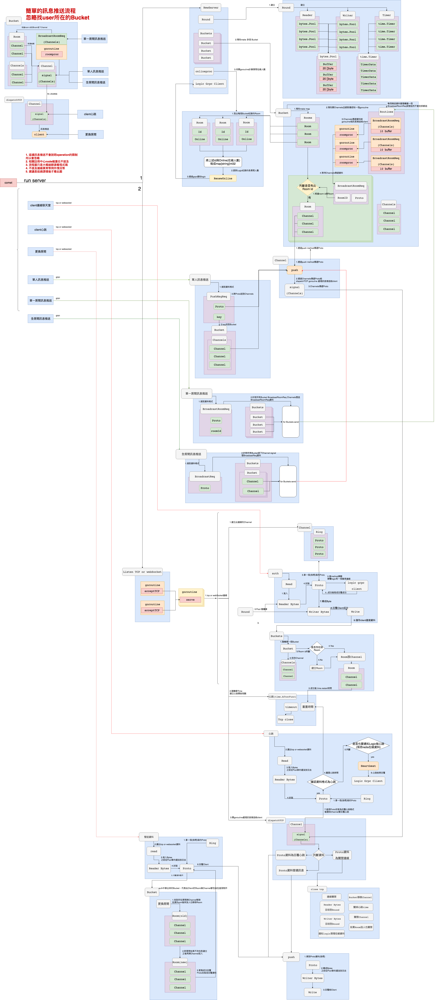
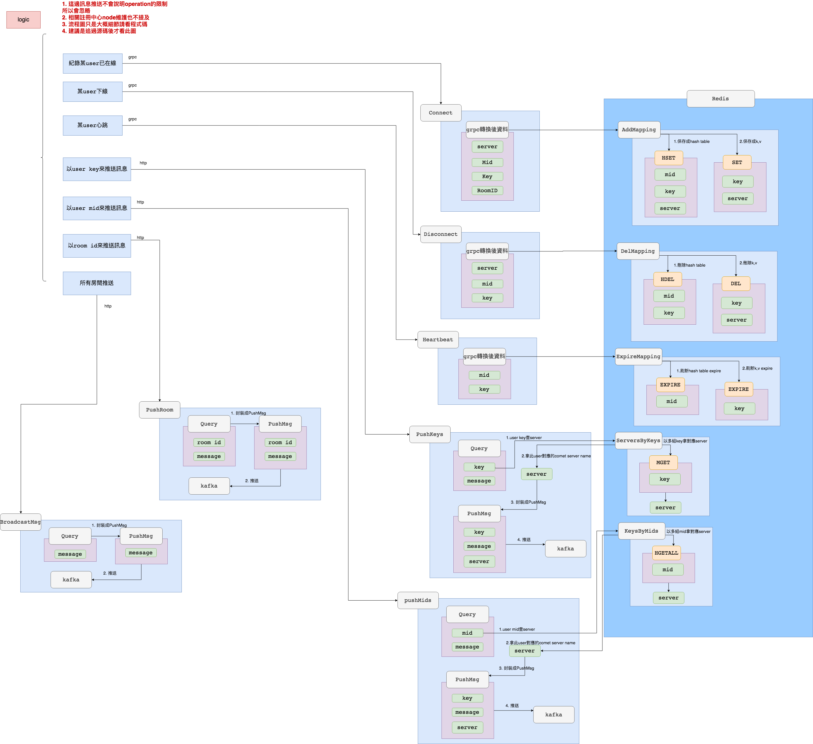
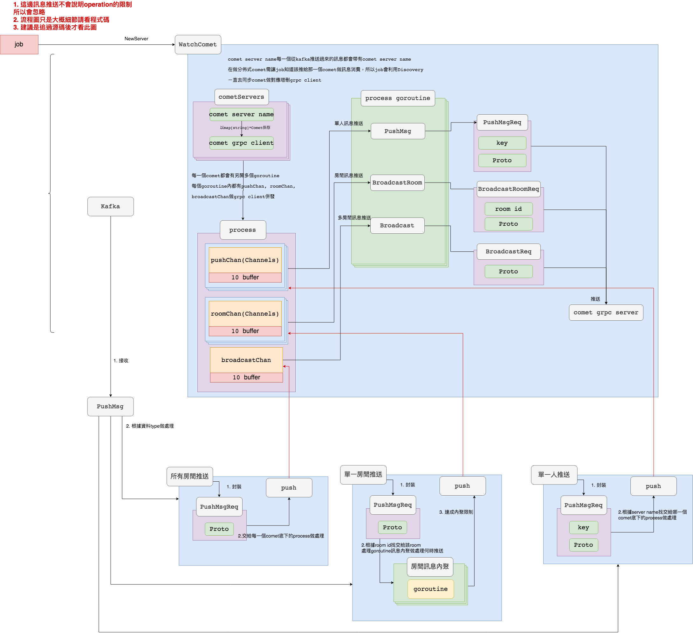

goim v2.0
==============
Document: https://github.com/Terry-Mao/goim

Add some annotations to the source code and draw the architecture diagram

## Features
 * Light weight
 * High performance
 * Pure Golang
 * Supports single push, multiple push and broadcasting
 * Supports one key to multiple subscribers (Configurable maximum subscribers count)
 * Supports heartbeats (Application heartbeats, TCP, KeepAlive, HTTP long pulling)
 * Supports authentication (Unauthenticated user can't subscribe)
 * Supports multiple protocols (WebSocket，TCP，HTTP）
 * Scalable architecture (Unlimited dynamic job and logic modules)
 * Asynchronous push notification based on Kafka

## Architecture

## comet

## logic

## job

