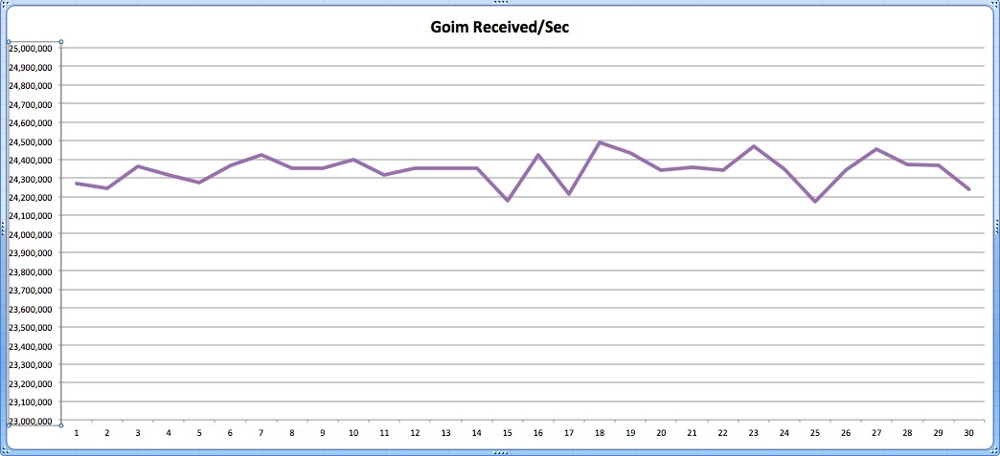
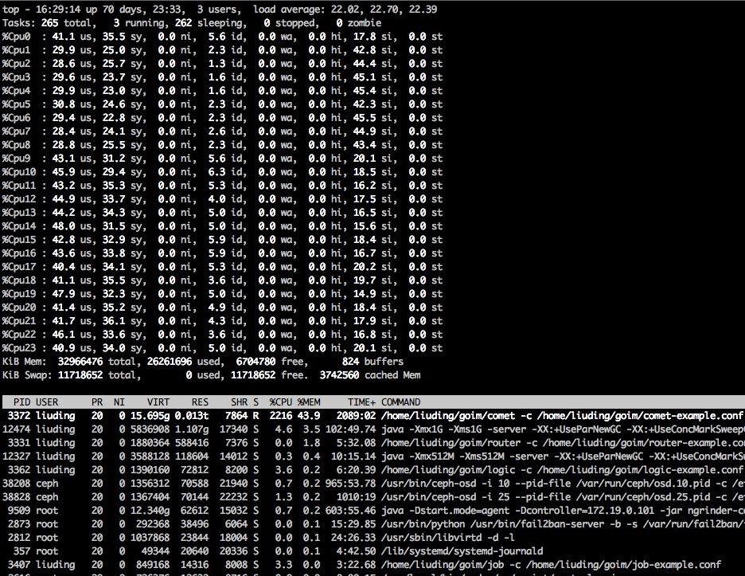

## Benchmark Chart

### Benchmark Server
| CPU | Memory | OS | Instance |
| :---- | :---- | :---- | :---- |
| Intel(R) Xeon(R) CPU E5-2630 v2 @ 2.60GHz  | DDR3 32GB | Debian GNU/Linux 8 | 1 |

### Benchmark Case
* Online: 1,000,000
* Duration: 15min
* Push Speed: 40/s (broadcast room)
* Push Message: {"test":1}
* Received calc mode: 1s per times, total 30 times

### Benchmark Resource

* CPU: 2000%~2300%
* Memory: 14GB
* GC Pause: 504ms
* Network: Incoming(450MBit/s), Outgoing(4.39GBit/s)

### Benchmark Result
* Received: 35,900,000/s

## Comet

## Network traffic

## Heap (include GC)

