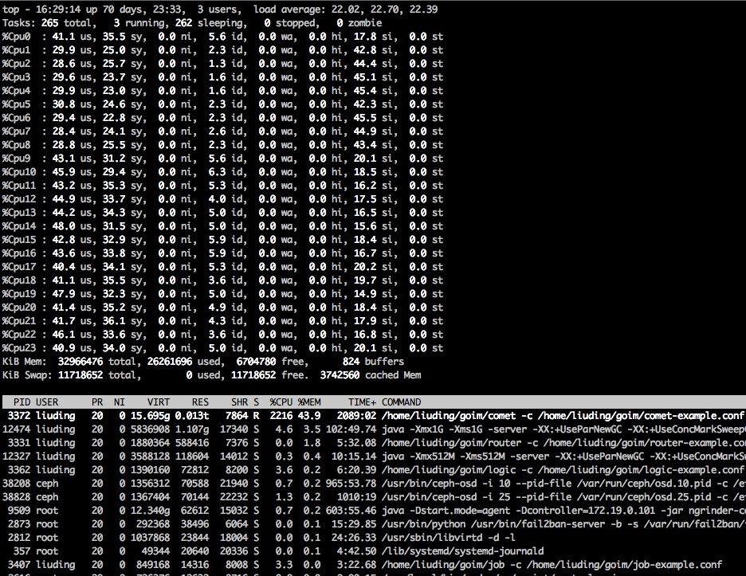
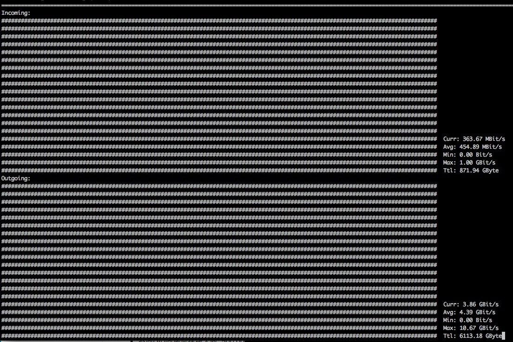
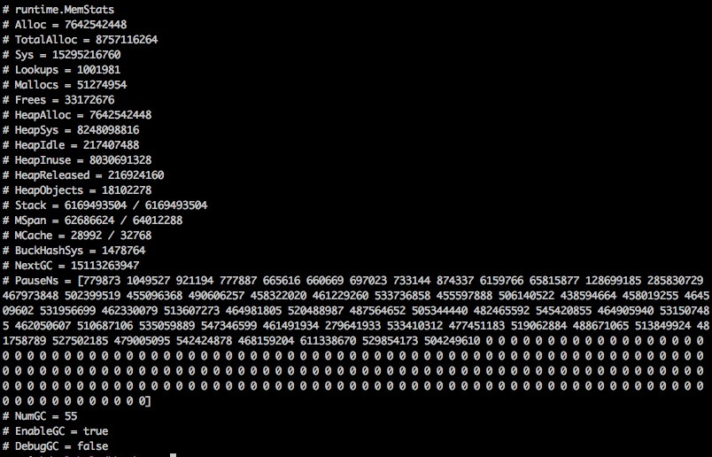

## 压测图表

### 服务端配置
| CPU | 内存 | 操作系统 | 数量 |
| :---- | :---- | :---- | :---- |
| Intel(R) Xeon(R) CPU E5-2630 v2 @ 2.60GHz  | DDR3 32GB | Debian GNU/Linux 8 | 1 |

### 压测参数
* 不同UID同房间在线人数: 1,000,000
* 持续推送时长: 15分钟
* 持续推送数量: 40条/秒
* 推送内容: {"test":1}
* 推送类型: 单房间推送
* 到达计算方式: 1秒统计一次,共30次

### 资源使用
* 每台服务端CPU使用: 2000%~2300%(刚好满负载)
* 每台服务端内存使用: 14GB左右
* GC耗时: 504毫秒左右
* 流量使用: Incoming(450MBit/s), Outgoing(4.39GBit/s)

### 压测结果
* 推送到达: 3590万/秒左右;

## comet模块

## 流量

## heap信息(包含GC)

